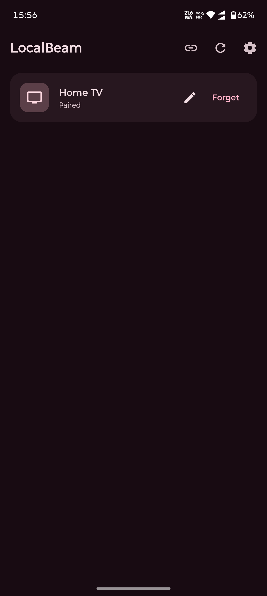
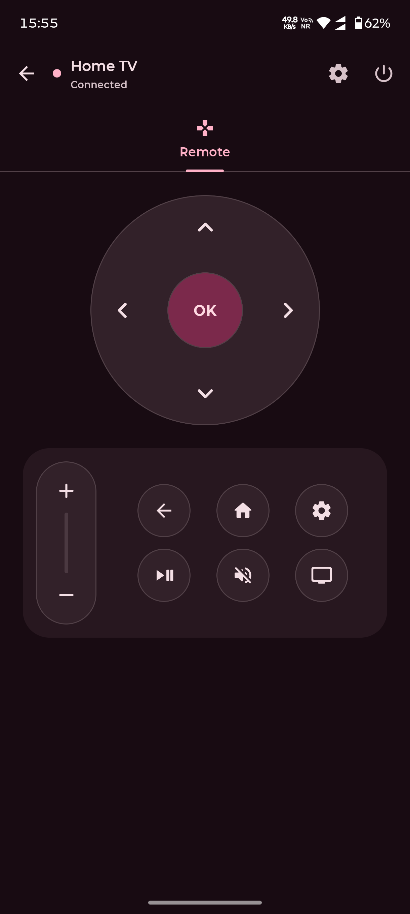
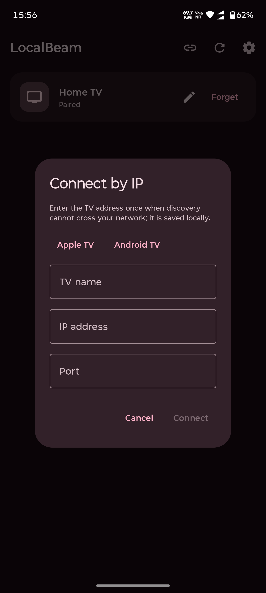

# LocalBeam

LocalBeam is a free, open-source Android remote for Apple TV and Android TV / Google TV. It communicates directly with supported TVs over the local network, without a cloud service, bridge server, advertising SDK, analytics SDK, tracker, or telemetry pipeline.

LocalBeam is an independent project. It is not affiliated with, endorsed by, or sponsored by Apple Inc. “Apple TV” is a trademark of Apple Inc., used only to describe compatibility.

<p align="center">
  <a href="docs/screenshots/home.png">
    
  </a>
  <a href="docs/screenshots/android-remote.png">
    
  </a>
  <a href="docs/screenshots/ip-add.png">
    
  </a>
</p>

<p align="center"><em>Paired TVs · Android TV remote · Manual IP connection</em></p>

## Highlights

- Direct local-network control for Apple TV and Android TV / Google TV.
- Apple TV Companion Link discovery and PIN pairing.
- Android TV Remote Service v2 discovery, TLS pairing, and remote control.
- D-pad navigation, select, Back, Home, Play/Pause, volume, mute, power, and TV input controls.
- Apple TV touchpad mode with swipe, tap, and long-press actions.
- mDNS discovery for normal home networks, plus manual IP connection for routed or multi-VLAN networks.
- Saved TV name, address, port, endpoint, and pairing credentials for future reconnects.
- Multiple paired TVs with a selectable default remote; a single paired TV opens directly on startup.
- Pull-to-refresh reconnect and automatic reconnect attempts after a connection loss.
- Responsive remote layout for phones, tablets, and larger Android displays.
- Material 3 light, dark, and system appearance modes with seven selectable color themes.
- Optional haptic feedback with configurable strength.
- English, Simplified Chinese, and Hindi UI translations.
- No ads, analytics, trackers, telemetry, cloud sync, or account system.

Keyboard input, voice input, and app launching are intentionally not exposed in the current remote UI. They are being reworked and are not documented as supported features in this release.

## Compatibility

### Phone

- Android 8.0 or newer (API 26+).
- Wi-Fi or another IP connection to the TV's network.

### TVs

- Apple TV models that expose the Companion Link remote service. The current target is tvOS 15+.
- Android TV / Google TV devices that expose Android TV Remote Service v2.

The phone and TV do not have to be on the same VLAN. They must be able to reach each other through the network firewall and routing policy.

## Getting started

1. Install LocalBeam from a release APK.
2. Keep the TV powered on and make sure its remote service is available.
3. Open LocalBeam and wait for discovery to list the TV.
4. Select the TV and enter the pairing code shown on the TV.
5. After pairing, the remote opens automatically. If more than one TV is paired, choose the preferred default in Settings.

### Apple TV pairing

On Apple TV, pairing access is controlled by **Settings → AirPlay and HomeKit → Allow Access**. Apple TV displays a four-digit PIN during pairing.

### Android TV pairing

Android TV uses the system Android TV Remote Service pairing screen and displays a six-character hexadecimal code. The TV should remain awake while pairing.

## Discovery and VLANs

LocalBeam uses mDNS/DNS-SD discovery on the local network. Discovery normally works only inside the same multicast or broadcast domain. Wi-Fi client isolation, blocked multicast, or routed VLAN boundaries can prevent a TV from appearing automatically.

When discovery cannot cross your network:

1. Tap **Connect by IP** on the TV list screen.
2. Select **Apple TV** or **Android TV**.
3. Enter a friendly TV name, the TV's IP address, and its port.
4. Tap **Connect** and complete pairing if the TV is not paired yet.

For Android TV, the standard control port is `6466` and the pairing port is `6467`. For Apple TV, the Companion Link port may change after a reboot; discovery or a refreshed manual port may be required.

The manually entered name and endpoint are saved locally. LocalBeam can reuse them for later connections and reconnects, so the address does not need to be entered again. The firewall must allow the required TCP traffic between the phone's VLAN and the TV's VLAN.

## Remote controls

The main remote provides:

- Directional navigation and select.
- Back and Home; on Apple TV, holding Home opens Control Center.
- Play/Pause.
- Volume up and down using the vertical volume control.
- Mute and TV input on Android TV.
- Guide and channel controls on Apple TV.
- Power control. On Android TV, the power key toggles the TV between awake and sleep states.

Apple TV also provides a separate touchpad tab. Android TV uses the direct remote control layout because its Remote Service v2 protocol does not expose the same touch surface.

Every remote key includes visible press feedback and optional haptic feedback. A disconnected remote displays its connection state and can be refreshed by pulling down or tapping **Reconnect**.

## Privacy and network behavior

LocalBeam is designed for local-only operation:

- No account, cloud backend, advertising, analytics, crash-reporting, tracker, or telemetry service is included.
- TV discovery uses mDNS on the local network.
- TV commands, pairing traffic, and reconnect traffic are sent only to the selected TV endpoint.
- Pairing credentials and saved endpoints are stored locally and wrapped with Android Keystore encryption.
- The `INTERNET` permission is required for local TCP sockets; it does not by itself imply an internet service or cloud connection.
- `CHANGE_WIFI_MULTICAST_STATE` and `ACCESS_WIFI_STATE` support local mDNS discovery.
- `VIBRATE` supports optional button feedback.
- Microphone access is optional and is not part of the current primary remote controls.

## Known limitations

- Apple TV Companion Link is a private, reverse-engineered protocol. A tvOS update may change behavior or require protocol updates.
- Android TV support depends on the device exposing Android TV Remote Service v2. Vendor firmware can disable or alter that service.
- mDNS discovery does not reliably cross VLANs; use manual IP connection when routing is available but multicast is not.
- Installed-app browsing and app launching are currently hidden from the UI.
- Keyboard and voice controls are currently hidden from the UI while their integrations are being reworked.
- Now-playing metadata and artwork are not currently implemented.

## Build from source

### Requirements

- JDK 17 or newer.
- Android SDK with the API 35 platform and build tools.
- Git with submodule support if you want the reference material included.

### Checkout

```bash
git clone --recurse-submodules https://github.com/anand34577/localbeam.git
cd localbeam
```

### Useful Gradle tasks

```bash
# Run the pure JVM protocol tests
./gradlew :protocol:test

# Build a debug APK
./gradlew :app:assembleDebug

# Run the local protocol CLI scanner
./gradlew :cli:run --args="scan"
```

On Windows, use `gradlew.bat` in place of `./gradlew`.

The debug APK is written to `app/build/outputs/apk/debug/`.

## Project structure

- `app/` — Android application built with Kotlin, Jetpack Compose, and Material 3.
- `protocol/` — pure Kotlin/JVM implementation of the Apple TV Companion Link protocol, including OPACK, TLV8, HAP pairing, ChaCha20-Poly1305 sessions, HID commands, touch events, and text-input protocol support.
- `cli/` — command-line harness for protocol discovery, pairing, commands, and diagnostics.
- `docs/protocol-notes.md` — verified protocol notes and porting references.
- `docs/screenshots/` — current English UI screenshots used in this README.

## Development notes

Protocol behavior is based on the documented behavior of the [pyatv](https://github.com/postlund/pyatv) project and the reference material in `references/`. Protocol changes should include focused JVM tests and an update to `docs/protocol-notes.md` where appropriate.

## Author and repository

- Author: Anand
- Repository: [github.com/anand34577/localbeam](https://github.com/anand34577/localbeam)

## License

LocalBeam is released under the [MIT License](LICENSE).
